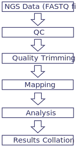

# Course: Running Bioinformatics Software on a Linux Computer Cluster

## Licence
This manual is © 2025, Steven Wingett

This manual is distributed under the creative commons Attribution-Non-Commercial-Share Alike 2.0 licence. This means that you are free:

to copy, distribute, display, and perform the work

to make derivative works

Under the following conditions:

Attribution. You must give the original author credit.

Non-Commercial. You may not use this work for commercial purposes.

Share Alike. If you alter, transform, or build upon this work, you may distribute the resulting work only under a licence identical to this one.

Please note that:

For any reuse or distribution, you must make clear to others the licence terms of this work.
Any of these conditions can be waived if you get permission from the copyright holder.
Nothing in this license impairs or restricts the author's moral rights.

Full details of this licence can be found at 
http://creativecommons.org/licenses/by-nc-sa/2.0/uk/legalcode

 
 
# Running bioinformatics pipelines with Nextflow

## What are bioinformatics pipelines?
For the past decade Next Generation Sequencing (NGS) has been used ever more frequently in molecular biology studies, finding uses in new experimental techniques and applications.  Processing NGS datasets is far from trivial however, for it requires substantial computational resources in terms of data storage, RAM (working memory) and processing power.

In addition to these demands, processing NGS datasets typically entails multiple steps, such as quality control (QC), mapping reads to a specified reference genome, followed by preliminary analysis of the alignments and then collating the headline results for the user.  This is not usually performed by one multi-purpose program, but rather a series of software tools – often developed independently of one another at separate academic institutions.  Such a series of steps is what we term a bioinformatics pipeline.

Figure 7 - overview of a generalised NGS bioinformatics pipeline

## Introducing Nextflow
Until recently it was common to see computer scientists and bioinformaticians writing code in their favourite “off-the-shelf” programming language, detailing how software applications relate to one another and how data should “flow” within a pipeline.  While many languages can adequately create pipelines, they were not designed with this objective exclusively in mind.  In contrast, Nextflow was designed from its inception as a bioinformatics workflow manager language and so has a multiplicity of features to streamline and regulate these processes.

We have set up Nextflow on the LMB cluster and it is run using the command line where it provides an interface between the user and Slurm.  In practical term this means that, you don’t need to submit Nextflow jobs as sbatch commands, just run them from a head node and Nextflow will manage everything for you.  Since Nextflow is a versatile and complex tool, there are many Nextflow commands and options that can be executed.  The Nextflow documentation is found at: https://nextflow.io

It is worth pointing out that since Nextflow is essentially a language to enable programmers to write bioinformatics pipelines, the documentation webpages may look heavy on technical jargon.  But not to worry, because the vast majority of this knowledge is not required for actually running a pipeline.

 
## Introducing nf-core
After establishing a syntax for describing bioinformatics workflows, the next goal for this community was to create pipelines for a range of NGS applications.  This endeavour is what became nf-core, essentially a repository of curated Nextflow pipelines.  These pipelines have pooled the opinions and efforts of experts on what constitutes best-practice in NGS processing.  The default settings should suit most standard protocols, but the pipelines have a wide range of options to accommodate different experimental procedures.

Having a large community of people working on nf-core is advantageous, since many eyes on the code helps identify bugs or unexpected behaviours.  Reproducibility has also been at the forefront of this endeavour, and the project is under citable version control and uses containers to ensure consistent data processing.  These projects grew from academic institutions and so Nextflow and nf-core are open-source and free to use.  The nf-core homepage is found at:
https://nf-co.re

We have made a selection of pipelines available on the LMB’s computer cluster.  Although not all the pipelines listed at nf-core are currently available here, we are willing to add more pipelines should there be demand from researchers.  Also, we may write and make available bespoke pipelines should the necessity arise.

## Setting up Nextflow / nf-core
Nextflow takes a little bit of setting up but we have tried to simplify this process by writing a Bash script that does this for you.  To download and run the bash script, execute the following one-line command (more experienced users may prefer to download the script and use it as a setup guide):

    curl -s https://raw.githubusercontent.com/StevenWingett/lmb-nextflow/main/nextflow_setup_cluster.sh | bash

You don’t need to know the details of what the script is doing, but you probably know enough by now to make sense of this step.  The curl command downloads an online script named nextflow_setup_cluster.sh.  The text from this file is written to standard out – which would by default be to your monitor screen.  However, this output is piped to bash.  So, in effect, this command runs the remote Bash script.

If you run the curl command, but don’t pipe it to standard out, you will be able to view the contents of nextflow_setup_cluster.sh.  You will see that the script has three parts:

i) set up Java (a requirement for Nextflow)
ii) Nextflow setup
iii) set up nf-core by installing Python3 (another programming language) modules.

By now, the code in the Bash script should broadly make sense.  We would like to draw you attention to the lines of code involving ~/.bashrc.  This refers to a hidden file in your home directory (remember: the tilda (~) denotes the home folder and hidden files have names beginning with a full stop).  

This .bashrc file sets up you Bash configuration and is read by the Bash shell every time you log in.  You can see that this hidden file in your home folder:

    ls -a ~

View the contents of this configuration file:

    cat ~/.bashrc

In this file you will see how the $PATH variable is set each time you login.  The relevant line begins: 
export PATH=

You need to edit this line to permanently add a location to the $PATH variable.  You will note that the downloaded Bash script added Nextflow to your path. 

Run the following command:

    nextflow run hello

Hello World! and other text should have been written to your screen.  If that didn’t work, log out of the cluster, log in again and re-try. 

Sorry that was little complicated, but you should only have to do this once.

### Installed pipelines
We shall now cover briefly the pipelines installed on the cluster.  We shan’t describe them in great detail since this information is already available in the official online documentation.

#### fetchngs
##### Overview
Downloading publicly submitted data and the accompanying metadata is not as simple as one might expect.  This pipeline takes a list of accessions and then downloads the corresponding data for the user.

##### Pipeline homepage
https://nf-co.re/fetchngs

##### Additional notes
We have written an ancillary script that creates symbolic links to the downloaded FASTQ files, only these links are named such that they include useful information – such as the source organism name.  This can make life easier for the bioinformatician, as it is then possible to tell what a file is solely from its name (although the new names can be somewhat long).

##### Download from: 
https://raw.githubusercontent.com/StevenWingett/lmb-nextflow/main/ancillary_scripts/fetchngs_renamer.py

#### rnaseq 
##### Overview
This is a bioinformatics pipeline for processing RNA-seq data.  The pipeline performs QC and then maps and quantitates the reads mapping to genes.

##### Pipeline homepage
https://nf-co.re/rnaseq

#### chipseq
##### Overview
This is a bioinformatics pipeline for mapping ChIP-seq data and calling peaks.

##### Pipeline homepage
https://nf-co.re/chipseq

##### atacseq
###### Overview
ATAC-seq peak-calling, QC and differential analysis pipeline.

###### Pipeline homepage
https://nf-co.re/atacseq

###### Running pipelines
Here are a few points to consider regarding running the nf-core pipelines:  

###### Read the documentation
Firstly, although the pipelines are standardised, they perform a diverse array of tasks and so may need to be launched with differing parameters.  For that reason, always refer to the official online nf-core documentation before running (and check you are looking at the documentation for the particular version of the pipeline installed on the cluster).

###### User friendly names
You will notice that submitted jobs will be assigned two-word names e.g. clever_brenner.  That makes looking up a job easier for the user.

###### Backgrounding
Backgrounding jobs is good practice for it means processing will continue if you disconnect from the terminal – this is almost always what you want to do.  To background a job, add -bg to the end of your Nextflow command.

###### Output directories
Pipeline output is written to a designated directory (GUIde Piper and previous versions of nf-core named this output folder results).  Intermediate files are written to a directory called work.

###### Multiqc
Once a pipeline completes, the MultiQC report is the best place to look initially to check the quality of the data and whether the pipeline ran correctly. 

###### BAM files
The mapped reads from the input FASTQ files will be saved as BAM format files.

###### Email
Look out for an email when your pipeline ends.

###### Hidden files
There are hidden log files in your current working directory such as .nextflow.log.

###### Tips on running pipelines
Where to run pipelines
We recommended processing data in the partition /cephfs2/ngs.  Create a folder in this location and name it after your username.  FILES IN THIS LOCATION ARE NOT BACKED UP AND WILL BE DELETED AFTER A FIXED PERIOD OF TIME.  However, /cephfs2/ngs has massive amounts of storage (hundreds of terabytes) and thus a suitable location for NGS processing.  You will receive periodic emails about your cluster storage from Scientific Computing

###### GUIde Piper
For many users new to bioinformatics, the volume of options available when running pipelines can seem overwhelming – even with the guidance available here and on the nf-core website.

To assist users in running pipelines we have put together the web tool GUIde Piper.  At present, all one typically needs to do when using GUIde Piper is to select the desired pipeline (e.g. RNA-seq), and then choose the required data / metadata file locations and the reference genome to map against. GUIde Piper will then produce a command that the user can copy and paste into the cluster command line to start Nextflow running.  The command should be appropriate for the most common experimental set-ups.

To visit GUIde-Piper on the intranet, go to: http://nextflow.lmb.internal/

##### Troubleshooting
Drives full
Although drives on the cluster have massive storage capacities, they can fill up!  When approaching capacity (>95% full) a Nextflow pipeline may fail when running in this location.  To check how full this partition is, run the command:

    df -H | grep [drive name]

If this partition is full, you could try running pipelines in your home directory, however the storage quota is limited to 100GB, which may not be enough for many NGS processing runs.

### Checkpoints and resume
Occasionally pipelines do fail and on a complex cluster with multiple nodes and users it is not uncommon for things to go wrong: for example a node goes into a non-responsive state or a data partition becomes full.  A way around this is to wait for the problem to be resolved and then re-launch the pipeline.  However, this can be quite frustrating if a pipeline has run for many hours and then you have to start again from the beginning.  Fortunately, Nextflow has a checkpointing system in which a failed pipeline can be relaunched with the additional flag -resume.  This will cause the job to clear-up any issues and then restart at the last checkpoint, potentially saving many hours of processing time.  (If this does not work, you may unfortunately need to start at the beginning.)

# Concluding remarks
So, that is the end of the Running NGS Pipelines course.  We have covered a lot of ground, for you should now be familiar with Linux and the Bash shell and you can write powerful Bash commands for a range of tasks and know where to get further information for tasks you can’t yet complete.  We explained what a compute cluster is and why researchers turn to this type of architecture to perform complex tasks.  We also introduced Slurm, the software used to manage job submissions on our setup at the LMB.  You also now know how to access a compute node and run interactive tasks, or alternatively write a Bash script and submit it to the Slurm queueing system.

In addition to the strictly computing aspects of this course, we have discussed how NGS technology works, with particular reference to the Illumina platform.  Processing such datasets is facilitated by bioinformatics pipelines which can be written using the specialist pipelining language Nextflow.  You can now run the community-developed nf-core workflows installed on our cluster.

We strongly recommend that you go out of your way to find reasons to use the LMB cluster and run a pipeline or two in the next few weeks.  If you don’t build upon your current knowledge, as the weeks turn into months, you will become less familiar with what you have just learned.

You should find the following references useful:

https://nextflow.io/  – the homepage of Nextflow.  
https://nf-co.re/ – the homepage of nf-core
https://slurm.schedmd.com/documentation.html  – the official Slurm documentation
https://www.mrc-lmb.cam.ac.uk/scicomp-new/index.php?id=computer-cluster – cluster documentation from Scientific Computing at the LMB

Happy processing!
