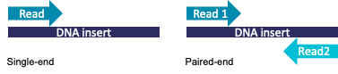
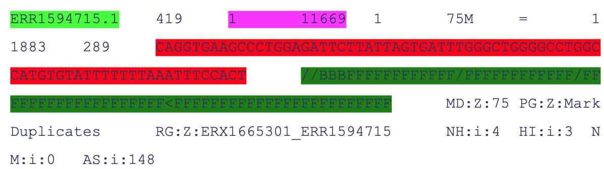

# Data Pipelines for Next Generation Sequencing Analysis

### Steven Wingett
---

## Talk overview
* Introducing next generation sequencing (NGS)
  
* Bioinformatics pipelines
  
* Running Nextflow & nf-core

---

# Next generation sequencing
### What it is, its applications and data types

---

## Next generation sequencing

* Next-generation sequencing (NGS) is a massively parallel sequencing technology

* Illumina platform most commonly used – very high throughput

* PacBio or Oxford Nanopore – longer reads but reduced throughput and accuracy
  

---

## Common NGS protocols
* Whole-genome sequencing
* RNA-seq
* ChIP-seq
* ATAC-seq
* Exome sequencing
* Targeted gene sequencing
* Methylation sequencing 	  	
* Metagenomic profiling	 	
* Chromosome capture sequencing (e.g. HiC)

---

## Bulk vs single cell
* Bulk is easier and cheaper to perform
* Bulk allows comparisons between different samples, tissues etc.
* But, bulk gives global **averages**
* Single cell reveals cell heterogeneity
* Single cell reveals rare cell types and transitions

---

## Common sequencers

|                          | iSeq 100 | MiniSeq | MiSeq Series | NextSeq 550 Series | NextSeq 1000 & 2000 | NovaSeq 6000 |
|--------------------------|----------|---------|--------------|--------------------|---------------------|--------------|
| Run Time (hours)         | 9.5–19   | 4–24    | 4–55	       | 12–30	            | 11-48	              | 13-44        |
| Maximum Output (Gb)	     | 1.2	    | 7.5	    | 15	         | 120	              | 330	                | 6000         |
| Maximum Reads	           | 4M       | 25M     | 25M	         | 400M		            | 1.1B                |	20B          |
| Maximum Read Length	(bp) | 2×150	  | 2×150   | 2×300        | 2×150              | 2×150               | 2 x 250      |

---

## Illumina sequencing construct

---

##### Illumina sequencing process - cluster generation

  

* Flowcell
* Lanes
* Oligo lawn
* Bridge amplification
    
---

##### Illumina sequencing process - sequencing by synthesis

* Fluorescent tag 

* Reversible terminator

* Detect colour of fluorescent emissions 

---

## Useful NGS terminology

* Single-end / paired-end
   

---

## Useful NGS terminology (2)

* Barcodes
  * multiplexing
  * short nucleotide sequences
  
 

* Unique molecular identifiers (UMIs)
  * longer nucleotide sequences
  * filter PCR duplicates

---

## From *in vitro* to *in silico*

---

## FASTQ file format 

* Standard sequencer output

* Text files, but normally **gzipped**

 
  
      @SRR071233.197343 NRTG514-16_0001:3:2:6067:17258 length=40
      TGGGTAGTATTTGGTTACATGAGTAAGTTCTTTAATGGTG
      +
      CCCCCCCCCCCCCCCCCCCCCCCCCCCCCCCCCCCCCCDC

---

## FASTQ file format (2)

* **Higher score better quality**

        Character: !"#$%&'()*+,-./0123456789:;<=>?@ABCDEFGHI
                   |                                       |
        Quality:   0                                       40

* Quality defined as:
  $$-10\log_{10}p$$

(in which *p* is the probability the base call is incorrect)

---

## A brief note on data storage

* Download **promptly** from the sequencing facility

* **Data corruption can occur during transfer!**

* **Check md5sums**

---

## A brief note on data storage (2)

* **FASTQ files cannot be replaced!**
  
* **Copy these files to a secure and backed-up location**  
  
* Typically files are backed up on `/istore` or `/isilon`
  
* Check with your group leader where best to store data
    
* If in doubt, please refer to IT / Scientific Computing

---

## A brief note on data storage (3)

* The Cell Biology Division has its own dedicated sequencing storage location

* **Members of Cell Biology should back up data there**
  
* Contact **Steven Wingett** or **Tim Stevens**

---

## What do I do next?

* FASTQ files need to be analysed
* What am I trying to do?
* What software do I need?
* What output files will be produced?

---

## Data analysis example: mapping reads
* Converts raw sequence data to genomic positions
* Each read is mapped to a reference genome
* Key NGS step in most applications

 

---

## Mapping output SAM / BAM

* **S**equence **A**lignment / **M**ap – **SAM**

* Compressed version – **BAM**

* Reading BAM files needs **samtools**

* Header lines (chromosomes / mapping parameters):

 

      @HD	VN:1.6	SO:coordinate
      @SQ	SN:1	LN:248956422
      @SQ	SN:10	LN:133797422
      @SQ	SN:11	LN:135086622

---

## Mapping output SAM / BAM (2)

* Read alignments (1 read shown below):

*  SAM format specification described here:
    https://samtools.github.io/hts-specs/SAMv1.pdf

---

# Nextflow bioinformatics pipelines
### What they are, and how to run them

---

## NGS bioinformatics processing
* NGS datasets require multiple independently developed tools to evaluate the data

* Data needs to flow from one tool another

---

## Introducing Nextflow

* Bioinformaticians join software with custom scripts

* Standardise pipelines with **Nextflow** (and Snakemake)

* You don’t need to program to be able to run Nextflow
  
* You have to learn Nextflow concepts, but then processing is managed for you

* Best place to run pipelines is the LMB computer cluster

---

## Introducing Nextflow (3)

* You don’t need to submit Nextflow jobs as `sbatch`

* Run Nextflow on a head node 

* Nextflow runs as a daemon process on a head node

* Nextflow farms out jobs to compute nodes 

* https://nextflow.io 

 

 

---

## Introducing nf-core

* Stop "reinventing the wheel"

* Community of developers

* 80+ pipelines

* Large community of users – support, code re-use

* Well documented

 

---

## Introducing nf-core (4)

* Events – tutorials, seminars, hackathons

* Reproducible

* Used at other institutions

*  https://nf-co.re

 

---

## Introducing nf-core (5)

---

## Nextflow pipelines on the cluster
* Downloading FASTQ files + metadata
* NGS QC
* RNA-seq
* ChIP-seq
* ATAC-seq
* Cut and Tag / Run
* 10x Single Cell RNA-seq
* Parse Evercode Single Cell RNA-seq
* Taxonomy Profiling

---

## Prerequisites
* You will need to be registered to gain access to the cluster 

* You should know how to use Linux

* You should know how to submit jobs to a Slurm computer cluster

* Install Nextflow for your own account
 
---

* If you do not meet these requirements, try our **LMB Computer Cluster Course**: 
 
    https://github.com/StevenWingett/Bioinformatics_Computer_Cluster_Course
  

---

## Pipeline help: GUIde-Piper

* Nextflow commands are reasonably complex:
  
  `nextflow run nf-core/rnaseq -r 3.6 --input design_file.txt --genome homo_sapiens.GRCh38.release_102 -config /public/singularity/containers/nextflow/lmb-nextflow/lmb.config --outdir results -bg`

---  

## Pipeline help: GUIde-Piper (2)

* But most follow the same basic template

* Online resource to generate Nextflow command

* http://guidepiper

---

## Pipeline output

* Clear, consistent output
  
* Pipeline execution reports
  
* Always check QC for problems!

---

## Pipeline output (2)

* Various other metrics reported, such as mapping efficiency

---

## Pipeline output (3)

* Common output data include:
  * Gene expression matrix (RNA-seq)

  * Peak positions (ATAC/ChIP-seq, CUT & Tag/Run)
  
  * IGV file for viewing results
  
---

## Publishing Data

* There are public data repositories for uploading data (e.g. GEO: https://www.ncbi.nlm.nih.gov/geo)

* Journals require the original FASTQ files to be submitted
  
* **WARNING! : No FASTQ files, no publication!**

---

## Summary

* How Illumina sequencing works

* Common sequencing file formats

* Software and pipelines
  
* Nextflow: a language for building and running pipelines
  
* nf-core: a collection of curated bioinformatics pipelines
  
* How to run pipelines

---

## Course web link

* https://stevenwingett.github.io/lmb_pipelines_course

* Thanks for listening!!!
