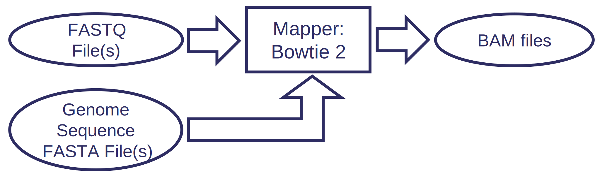
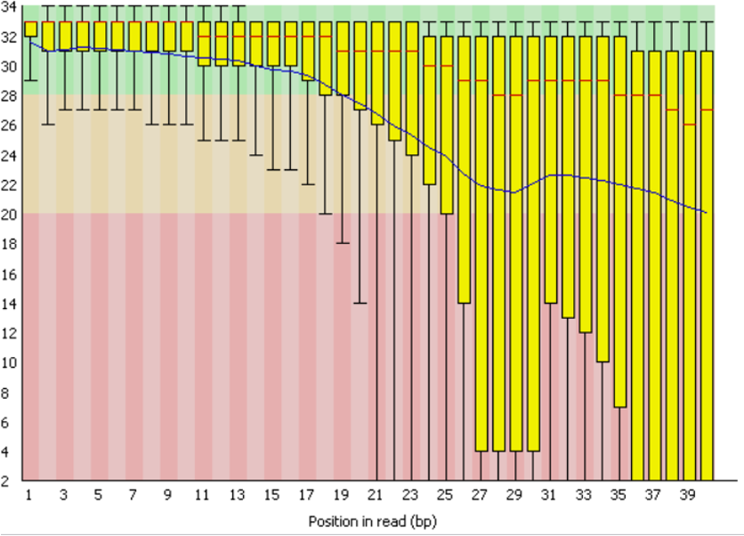
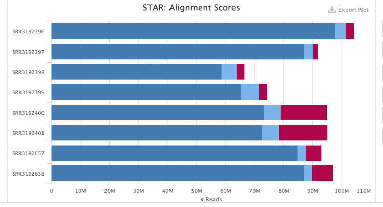

# Course: Running Next Generation Sequencing Pipelines on a Computer Cluster

---

## Course aims
* Introduction to analysing next-generation sequencing (NGS) data
* Learn about bioinformatics pipelines
* Run Nextflow & nf-core

---

## Prerequisites
* You will need to be registered to gain access to the cluster 

* You should know how to use Linux

* You should know how to submit jobs to a Slurm computer cluster

* If you do not meet these requirements then try the cluster course: https://github.com/StevenWingett/Bioinformatics_Computer_Cluster_Course
  
---

# Part 1: Next generation sequencing
### What it is, its applications and data types

---

## Next generation sequencing

* Next-generation sequencing (NGS) is a massively parallel sequencing technology

* Illumina platform most commonly used – very high throughput

* PacBio or Oxford Nanopore – longer reads but less throughput

---

## Common types of analysis
* Whole-genome sequencing
* RNA-seq
* ChIP-seq
* ATAC-seq
* Exome sequencing
* Targeted gene sequencing
* Methylation sequencing 	  	
* Metagenomic profiling	 	
* Chromosome capture sequencing (e.g. HiC)

---

## Bulk vs Single Cell
* Bulk is easier and cheaper to perform
* Bulk gives global averages
* Bulk allows comparisons between different samples, tissues etc.
* Single cell reveals cell heterogeneity
* Single cell reveal rare cell types and transitions

---

## Common Sequencers

|                          | iSeq 100 | MiniSeq | MiSeq Series | NextSeq 550 Series | NextSeq 1000 & 2000 | NovaSeq 6000 |
|--------------------------|----------|---------|--------------|--------------------|---------------------|--------------|
| Run Time (hours)         | 9.5–19   | 4–24    | 4–55	       | 12–30	            | 11-48	              | 13-44        |
| Maximum Output (Gb)	     | 1.2	    | 7.5	    | 15	         | 120	              | 330	                | 6000         |
| Maximum Reads	           | 4M       | 25M     | 25M	         | 400M		            | 1.1B                |	20B          |
| Maximum Read Length	(bp) | 2×150	  | 2×150   | 2×300        | 2×150              | 2×150               | 2 x 250      |

---

  

##### Illumina sequencing process - cluster generation
* Flowcell
* Lanes
* Oligo lawn
* Bridge amplification
  
 *(Image courtesy of Abizar, Wikipedia)* 
  
---

##### Illumina sequencing process - sequencing by synthesis

 

* Fluorescent tag 

* Reversible terminator

* Record colour of fluorescent emissions 

*(Image courtesy of courtesy of DMLapato, Wikipedia)*

---

## Other NGS terms

* Paired-end / single end
   

---

## Other NGS terms (2)

* Barcodes
  * multiplexing
  * short nucleotide sequences
  
 

* Unique molecular identifiers (UMIs)
  * longer nucleotide sequences
  * filter PCR duplicates

---

## Illumina Sequencing Adapters

---

## File formats – FASTQ

* Standard sequencer output

* Text files, but normally gzipped

 
  
      @SRR071233.197343 NRTG514-16_0001:3:2:6067:17258 length=40
      TGGGTAGTATTTGGTTACATGAGTAAGTTCTTTAATGGTG
      +
      CCCCCCCCCCCCCCCCCCCCCCCCCCCCCCCCCCCCCCDC

---

## File formats – FASTQ 2

* Explanation of quality scores – higher score better quality

        Character: !"#$%&'()*+,-./0123456789:;<=>?@ABCDEFGHI
                   |                                       |
        Quality:   0                                       40

* Quality defined as:
  $$-10\log_{10}p$$

(in which p is the probability the base call is incorrect)

---

## File Formats – SAM / BAM

* Sequence Alignment / Map – SAM

* Compressed version – BAM

* Reading BAM files needs samtools

* Header lines (information on mapping parameters):

 

      @HD	VN:1.6	SO:coordinate
      @SQ	SN:1	LN:248956422
      @SQ	SN:10	LN:133797422
      @SQ	SN:11	LN:135086622

---

## A brief note on data storage

* **Download promptly from the sequencing facility and store in a secure, clearly labelled and backed-up location**

* **Check file sizes and md5sum before and after transfer to check for corruption during transfer – which can occur!**

---

## A brief note on data storage (2)

* **FASTQ files cannot be replaced**
  
* **Copy these file to a secure and backed-up location**  
  
* Typically files are backed up on `/istore` or `/isilon`
  
* Check with your group leader where best to store data
    
* If in doubt, please refer to IT / Scientific Computing

---

## A brief note on data storage (3)

* The Cell Biology Division has its own dedicated sequencing storage location

* **Members of Cell Biology should back up data there**
  
* Contact Steven Wingett or Tim Stevens**

---

## Mapping Reads
* Converts raw sequence data to genomic positions
* Each read is mapped to a reference genome
* Key NGS step in most applications

 

---

## Mapping output SAM / BAM

* Read alignments (1 read shown below):

*  SAM format specification described here:
    https://samtools.github.io/hts-specs/SAMv1.pdf

---
## Exercise 1
---

## Part 2
### Nextflow bioinformatics pipelines

---

## NGS bioinformatics processing
* NGS datasets require multiple independently developed to evaluate the data

* Data needs to flow from one tool another

---

## Introducing Nextflow

* Bioinformaticians join software with custom scripts

* Movement to standardise pipelines with **Nextflow** (and Snakemake)

* But, you don’t need to program to be able to run Nextflow
  
* You have to learn Nextflow concepts, but then processing is managed for you

---

## Introducing Nextflow (2)

* You don’t need to submit Nextflow jobs as `sbatch`

* Run Nextflow on a head node 

* Nextflow runs as a daemon process on a head node

* Nextflow farms out jobs to compute nodes 

* https://nextflow.io 

 

 

---

## Introducing nf-core

* Contributions of a community of developers

* Over 50 pipelines (although multiple options)

* Large community of users – support, code re-use

* Well documented

 

---

## Introducing nf-core (2)

* Events – tutorials, seminars, hackathons

* Used at other institutions

*  https://nf-co.re

 

---

## Installed pipelines
* Downloading FASTQ files + metadata
* NGS QC
* RNA-seq
* ChIP-seq
* ATAC-seq
* Cut and Tag / Run
* 10x Single Cell RNA-seq
* Parse Evercode Single Cell RNA-seq
* Taxonomy Profiling

---

## Setting-up Nextflow & nf-core

* We’ve tried to simplify this with a single command to run from a head node:
  
      curl -s https://raw.githubusercontent.com/StevenWingett/lmb-nextflow/main/nextflow_setup_cluster.sh | bash

* Downloads and runs a Bash script

* Bash command edits your `~/.bashrc` file and installs Python modules

---

## Tips on running pipelines

* All pipelines are different: read the documentation at nf-core

* Run pipelines in a location with adequate storage (most likely not your home directory)

* Background your pipelines `-bg`

* Every job is assigned a name e.g. clever_brenner

---

## Tips on running pipelines (2)

* You will get an email when the pipeline completes
  
* Check the MultiQC report
  
* Your aligned files with be BAM format

---

## Pipeline help: GUIde-Piper

* Nextflow commands are reasonably complex:
  
  `nextflow run nf-core/rnaseq -r 3.6 --input design_file.txt --genome homo_sapiens.GRCh38.release_102 -config /public/singularity/containers/nextflow/lmb-nextflow/lmb.config --outdir results -bg`

---  

## Pipeline help: GUIde-Piper (2)

* But most follow the same basic template

* Online resource to generate Nextflow command

* http://guidepiper

---

## Pipeline output

* Clear, consistent output
  
* Pipeline execution reports
  
* Always check QC for problems!

---

## Pipeline output (2)

* Various other metrics reported, such as mapping efficiency

---

## Pipeline output (3)

* Common output data include:
  * Gene expression matrix (RNA-seq)
  * Peak positions (ATAC/ChIP-seq, CUT & Tag/Run)
  * IGV file for viewing results
  
---

## Exercise 2

---

## Troubleshooting

* More than 90% full – Nextflow will fail!

* `df -H | grep [partition name]`

* Maybe use home directory?

* Checkpoints

* `-resume`

---

## Publishing Data

* There are public data repositories for uploading data (e.g. GEO: https://www.ncbi.nlm.nih.gov/geo)

* Journals require the original FASTQ files to be submitted
  
* **WARNING! : No FASTQ files, no publication!**

---

## Summary

* Explained Illumina sequencing
* Nextflow, a language for building and running pipelines
* nf-core, a collection of curated bioinformatics pipelines
* How to run pipelines
* Find a reason to have a go in the coming weeks
* Thanks for listening!!!
